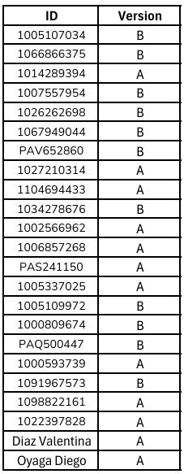

# Taller 5 - Pages
---
## Fecha de entrega: 10 Septiembre 2025
---

## Definición básica

- Cada *Page* es una clase en el archivo `__init__.py`.

- Controla qué se muestra y cómo interactúa el jugador.

- Se asocia normalmente con una plantilla *HTML* en la carpeta `templates`.

```python
    class MyPage(Page):
        form_model = 'player'
        form_fields = ['age', 'gender']
```

Esto muestra un formulario con las variables `age` y `gender` del jugador.

---

## Atributos importantes

`form_model` → indica de qué modelo provienen los campos (`player`, `group`, `subsession`).

`form_fields` → lista de variables que aparecerán como formulario.

`timeout_seconds` → tiempo límite en segundos para esa página.

`timer_text` → texto que se muestra junto al contador.

---

## Métodos comunes

`is_displayed(self)`

Decide si la página se muestra o no:

```python
    def is_displayed(self):
        return self.player.round_number == 1
```

`before_next_page(self, timeout_happened)`

Se ejecuta justo antes de avanzar a la siguiente página:

```python
    def before_next_page(self, timeout_happened):
        if timeout_happened:
            self.player.response = -1
```

`vars_for_template(self)`

Pasa variables extra al HTML:

```python
    def vars_for_template(self):
        return dict(payoff=self.player.payoff)
```

---

## Orden de las páginas

Al final del archivo `__init__.py` se define la lista `page_sequence`, que indica en qué orden se muestran:

```python
    page_sequence = [Consent, Instructions, MyPage, Results]
```

---

## Plantillas HTML

- Cada Page busca un archivo con el mismo nombre en templates/nombre_app/.

- Ejemplo: para class MyPage(Page) → templates/nombre_app/MyPage.html.

Ejemplo de HTML:

```html
    
    
        <h1>Por favor ingresa tus datos</h1>
        {{ formfields }}
        <button type="submit">Continuar</button>
    
```

---

## Resumen

- Las Pages son las pantallas del experimento.

- Cada clase Page controla qué ve el participante, qué datos ingresa, cuánto tiempo tiene y en qué orden aparece.

- Se conectan con plantillas HTML para mostrar la interfaz.

---

### Recursos útiles

- [Documentación oficial de oTree - Models](https://otree.readthedocs.io/en/latest/pages.html)

- [Ejemplos oficiales de oTree](https://www.otreehub.com/)

- [Guía rápida de oTree en español (GitHub)](https://github.com/otree-org/otree)

---
## Juego Matching Pennies

1. Participantes:

- Se juega entre 2 jugadores.

- Uno tiene el rol de **Matcher** (quiere que las elecciones coincidan).

- El otro es el **Mismatcher** (quiere que las elecciones sean distintas).

2. Decisiones:

- Cada jugador elige cara (**Heads**) o cruz (**Tails**) de forma simultánea.

- Además, cada jugador indica un **porcentaje entre 0** y **100%** que representa cuánto desea recibir de un premio fijo si gana.

3. Quién gana:

- Si ambos sacan lo mismo (Heads–Heads o Tails–Tails) → gana el **Matcher**.

- Si sacan distinto (Heads–Tails o Tails–Heads) → gana el **Mismatcher**.

4. Pago:

- Solo una de las rondas del juego se paga (elegida al azar).

- El ganador de esa ronda recibe el premio **100** × **porcentaje elegido**.

- El perdedor recibe 0.

5.Duración:

- El juego se repite en varias rondas.

- En algún momento los roles se invierten, de modo que ambos jugadores pasan por ser Matcher y Mismatcher.

---
## 📚 Actividad practica 


❗**Nota:** `Recordar usar el método de entrega de actividades y parciales indicado en la sección de "Entrega de actividades y parciales" del curso.` *[Click para visitar "Entrega de actividades y parciales" en la introducción del curso.](../../README.md)*

1. [QUIZ Coordination](https://forms.gle/fkPgumXodH44Xj5i9)

2. Matching Pennies:

    - Versión A:

        a. Realizar un Fetch del repositorio de GitHub.

        b. En la `Page``Choice` nos falta definir de que modelo lógico queremos tomar los datos, definamos el atributo `form_model` para que tome los datos del modelo `player`.

        c. En la `Page``Choice` nos falta definir una de las variables que queremos que el jugador ingrese, definamos el atributo `form_fields` para que tome la variable `penny_side` también.

        d. Queremos que en la pagina de espera `ResultsWaitPage` se le calcule el puntaje al jugador, para esto debemos definir el método `after_all_players_arrive` y dentro de este llamar al método `set_payoffs`.

        e. Al parecer de versiones anteriores nos quedó un código de una pagina que ya no usamos, eliminemos la clase `Instrucciones` y su referencia en la lista `page_sequence`.

    ---

    - Versión B:

        a. Realizar un Fetch del repositorio de GitHub.

        b. En la `Page``Choice` nos falta definir una de las variables que queremos que el jugador ingrese, definamos el atributo `form_fields` para que tome la variable `porcentaje` también.

        c. Dentro de la función `vars_for_template` de la `Page``ResultsSummary` debemos retornar el puntaje de cada jugador, para esto debemos agregar la variable `player_in_all_rounds` y definir que tome el valor de `player_in_all_rounds,` en el retorno que nos da la función.

        d. A la variable `session` del `vars_for_template` de la `Page``ResultsSummary` le falta asignarle un valor, asignemos el valor de `player.session`.

        e. Al parecer de versiones anteriores nos quedó un código de una pagina que ya no usamos, eliminemos la clase `Instrucciones` y su referencia en la lista `page_sequence`.

En la siguiente lista se realiza la asignación de la versión a entregar. La asignación se realizó **al azar** y a **cada ID** de le asignó **una versión**: 



Dependiendo de la versión asignada, deberás cumplir con las tareas correspondientes a cada una y para una mejor verificación de lo realizado **tomar una ScreenShot al finalizar cada inciso**, **adjuntar las imágenes con el proyecto creado en un zip al correo designado**. Evitar archivos adicionales en el zip, **solo** debe contener la carpeta del proyecto y las imágenes solicitadas. Verificar que el proyecto enviado tenga los **cambios guardados**.

Enlaces de interés:

- [Apoyo Taller 5]()

- [Rúbrica de calificación](Rubrica_Taller_Matching_Pennies.pdf)