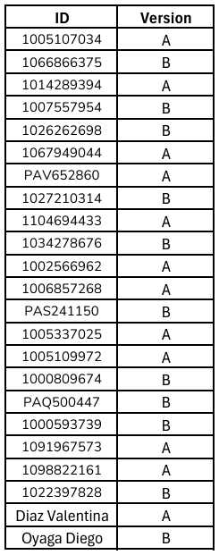

# Taller 6 - Templates

---
## Fecha de entrega: 17 Septiembre 2025
---

## ¿Qué son los templates en oTree?

- Son archivos HTML con sintaxis Django (usa `{{ }}` y ``).

- Se utilizan para definir la interfaz que verán los participantes en cada página del experimento.

- Normalmente se guardan en la carpeta `templates/<nombre_app>/`. **Si bien es una convención, no es obligatorio y en proyectos no se tiende a seguirla.**

---

## Estructura básica

Un template de oTree suele verse así:

```html
    

    
        Instrucciones
    

    
        <p>Bienvenido al experimento.</p>
        <p>Tu pago inicial es de {{ C.STAKES }}</p>

        {{ formfields }}  <!-- Aquí se renderizan los campos de formulario definidos en la clase Page -->
        {{ next_button }} <!-- Botón para avanzar a la siguiente página -->
    
```

---

## Bloques importantes

1. ``

    - Indica que hereda de una plantilla base de oTree.

    - Puedes crear tus propios layouts si lo necesitas.

2. `` y ``

    - title: Título de la página.

    - content: Contenido central que verá el jugador.

3. Etiquetas útiles:

    - `{{ formfields }}` → Renderiza todos los campos definidos en la Page de Python.

    - `{{ formfield 'variable' }}` → Renderiza un campo específico.

    - `{{ next_button }}` → Botón para avanzar.

    - `{{ player.variable }}`, `{{ group.variable }}`, `{{ subsession.variable }}` → Muestra datos guardados.

    - `{{ if ... }}` o `` → Control de flujo en HTML.

---

## Organización de templates

- Globales: en `templates/global/`, accesibles para todas las apps (ejemplo: `Page.html`, `Base.html`).

- Locales: en `templates/<app>/`, solo visibles dentro de esa app.

- Reutilizables: puedes hacer fragmentos (`.html`) y luego incluirlos con ``.

---

## Buenas prácticas

- Usar `formfields` o `formfield` en vez de hacer formularios HTML manuales, salvo que quieras algo muy personalizado.

- Separar estilos en un CSS en `static/`.

- Usar `` y `` para adaptar dinámicamente el contenido según variables del experimento.

- Recordar que los templates nunca deben tener lógica compleja → eso va en el `__init__.py`.

---

## Ejemplo práctico

Supongamos que quieres mostrar una matriz con botones de opción (tipo cuestionario):

```html
    

    
        <h3>Encuesta</h3>

        <table>
            <tr>
                <th>Pregunta</th>
                <th>Totalmente en desacuerdo</th>
                <th>Neutral</th>
                <th>Totalmente de acuerdo</th>
            </tr>
            <tr>
                <td>Me gusta participar en experimentos</td>
                <td>{{ formfield 'q1' with label='' }}</td>
                <td>{{ formfield 'q2' with label='' }}</td>
                <td>{{ formfield 'q3' with label='' }}</td>
            </tr>
        </table>

        {{ next_button }}
    
```

---

## Resumen

Los templates en oTree son HTML con Django templating, se usan para mostrar la interfaz, los formularios y botones, y permiten personalizar mucho la experiencia del jugador.

---

### Recursos útiles

- [Documentación oficial de oTree - Templates](https://otree.readthedocs.io/en/latest/templates.html)

- [Ejemplos oficiales de oTree](https://www.otreehub.com/)

- [Guía rápida de oTree en español (GitHub)](https://github.com/otree-org/otree)

---

## Dilema del prisionero

El **Dilema del Prisionero** es un juego de decisión estratégica entre dos personas. La situación es esta:

- Cada jugador debe elegir entre cooperar o traicionar (defectar).

- No saben qué elegirá el otro cuando toman su decisión.

- Las recompensas dependen de la combinación de elecciones:

    - **Caso 1.** Si los dos cooperan → ambos ganan una recompensa moderada.

    - **Caso 2.** Si uno coopera y el otro traiciona → el que traiciona se lleva la máxima recompensa, mientras que el que cooperó recibe lo peor.

    - **Caso 3.** Si los dos traicionan → ambos terminan con una recompensa baja.

El dilema es que:

- Lo mejor para el grupo sería que ambos cooperen.

- Lo mejor para cada individuo (pensando de manera egoísta) es traicionar, porque asegura no quedar en cero si el otro coopera.

- Pero si ambos piensan así y traicionan, terminan peor que si hubieran cooperado.

En esencia, es un juego que muestra el conflicto entre el interés individual y el bien común.

---
## 📚 Actividad practica


❗**Nota:** `Recordar usar el método de entrega de actividades y parciales indicado en la sección de "Entrega de actividades y parciales" del curso.` *[Click para visitar "Entrega de actividades y parciales" en la introducción del curso.](../../README.md)*

1. [QUIZ Social Preferences](https://forms.gle/j4mcgNEJJ9RpKZAD8)

2. Prisoner's Dilemma:

    - Versión A:

        a. Realizar un Fetch del repositorio de GitHub.

        b. En el template `Decision.html`, tenemos una inclusion incompleta de las instrucciones, agregamos `instructions.html` en `{{ include_sibling '' }}` para completar dicha inclusión.

        c. Necesitamos comunicarnos con el otro jugador para ellos agregaremos un chat usando `{{ chat }}` en el template `Decision.html`, justo después de `Here you can chat with the other participant.`.

        d. Debemos agregar la ganancia del jugador, usando `{{ player.payoff }}` en el template `Results.html`, en la misma linea de `As a result, you earned `.

        e. En el template `instructions.html`, esta vacía la sección de los estilos de la tabla, debemos rellenar el espacio de `style =''` con `width: auto; margin: auto`.

        f. Finalmente, debemos correr el experimento y verificar que los cambios se hayan aplicado correctamente.
    ---

    - Versión B:

        a. Realizar un Fetch del repositorio de GitHub.

        b. En el template `Results.html`, tenemos una inclusion incompleta de las instrucciones, agregamos `instructions.html` en `{{ include_sibling '' }}` para completar dicha inclusión.

        c. En el template `Results.html`, debemos agregar el condicional para mostrar el mensaje correcto dependiendo de la elección del jugador, para esto usamos `if same_choice` en el reglón anterior a `Both of you chose to {{ my_decision }}.`.

        d. Necesitamos comunicarnos con el otro jugador para ellos agregaremos un chat usando `{{ chat }}` en el template `Decision.html`, justo después de `Here you can chat with the other participant.`.

        e. En el template `Decision.html`, esta vacía la sección de los estilos de la tabla, debemos rellenar el espacio de `style =''` con `width: auto; margin: auto`.

        f. Finalmente, debemos correr el experimento y verificar que los cambios se hayan aplicado correctamente.


En la siguiente lista se realiza la asignación de la versión a entregar. La asignación se realizó **al azar** y a **cada ID** de le asignó **una versión**: 



Dependiendo de la versión asignada, deberás cumplir con las tareas correspondientes a cada una y para una mejor verificación de lo realizado **tomar una ScreenShot al finalizar cada inciso**, **adjuntar las imágenes con el proyecto creado en un zip al correo designado**. Evitar archivos adicionales en el zip, **solo** debe contener la carpeta del proyecto y las imágenes solicitadas. Verificar que el proyecto enviado tenga los **cambios guardados**.

Enlaces de interés:

- [Apoyo Taller 6]()

- [Rúbrica de calificación](Rubrica_Taller_Prisioner.pdf)