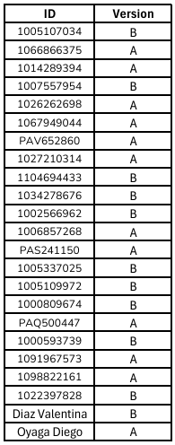

# Taller 7 - Multiplayer Games

---
## Fecha de entrega: 24 Septiembre 2025
---

## ¿Qué son los multiplayer games en oTree?

En oTree, el tema de Multiplayer Games hace referencia a experimentos o juegos en los que más de un participante interactúa dentro de un mismo grupo, compartiendo un espacio de decisión común. A diferencia de los juegos individuales, en los que cada persona responde de manera independiente y sus elecciones solo afectan su propio pago, en los juegos multijugador las decisiones de cada jugador impactan directamente en los demás miembros de su grupo. Esto abre la posibilidad de analizar fenómenos como la cooperación, la negociación, la competencia estratégica y la coordinación de acciones colectivas.

Estos juegos son muy utilizados en economía experimental y en ciencias sociales porque permiten observar cómo se comportan las personas en situaciones interdependientes. Por ejemplo, en un Public Goods Game, los jugadores deben decidir cuánto de su dotación personal aportan a un fondo común, y el resultado final depende de la suma de todos los aportes. En un Bargaining Game, dos participantes deben negociar cómo dividir un recurso; si no logran coordinarse, ambos pueden terminar sin nada.

Además, los Multiplayer Games pueden diseñarse tanto de manera simultánea (todos deciden al mismo tiempo) como secuencial (las decisiones se revelan en orden, uno tras otro). Esta flexibilidad permite estudiar dinámicas distintas: la primera resalta la incertidumbre y la estrategia frente a lo desconocido, mientras que la segunda resalta el efecto de la información y del liderazgo en la toma de decisiones.

Gracias a la estructura de grupos y roles en oTree, se pueden crear interacciones entre 2, 3 o más jugadores dentro de la misma ronda, y cada rol puede tener reglas, información y decisiones específicas. En conjunto, los Multiplayer Games en oTree constituyen una herramienta poderosa para explorar cómo los individuos toman decisiones cuando deben interactuar, colaborar o competir con otros en entornos controlados de laboratorio o en línea.

---

## Conceptos clave

- **Groups**: 
    En oTree, los jugadores se organizan en grupos dentro de cada ronda. El tamaño del grupo depende del diseño del juego.

    ```python
        class C(BaseConstants):
            PLAYERS_PER_GROUP = 2  # Ejemplo: juego de 2 jugadores
    ```

- **Interdependencia**:     
    Las decisiones de un jugador influyen en los pagos o resultados de los demás. Por ejemplo, en un juego de negociación si ambos jugadores demandan más de lo disponible, todos pierden.

- **Sincronización**
    Para que funcione la interacción, oTree utiliza WaitPages, que hacen que todos los jugadores de un grupo lleguen al mismo punto antes de continuar. Esto garantiza que las decisiones se procesen en conjunto.

    ```python
        class Espera(Page):
        @staticmethod
        def is_displayed(player):
            return True

        class GroupWaitPage(WaitPage):
            wait_for_all_groups = True
    ```

---

### Ejemplos típicos de multiplayer games en oTree

- **Bargaining game:** dos jugadores negocian cómo dividir un recurso.

- **Public Goods Game:** varios jugadores deciden cuánto aportar a un fondo común.

- **Prisoner’s Dilemma:** dos jugadores eligen entre cooperar o traicionar.

- **Trust Game:** un jugador envía dinero al otro, que decide cuánto devolver.

- **Voting Games:** los jugadores votan en grupo y el resultado afecta a todos.

---

## Ventajas de oTree para multiplayer games

- Permite emparejar jugadores automáticamente en cada ronda.

- Maneja **roles dentro del grupo** (por ejemplo, jugador A y jugador B).

- Controla el **tiempo real**: se pueden configurar límites de tiempo por ronda o decisión.

- Compatible con **juegos secuenciales** y **simultáneos**.

---

## Resumen

En resumen, **Multiplayer Games en oTree** son ideales para estudiar **preferencias sociales**, **cooperación**, **negociación** y **toma de decisiones estratégicas** en contextos donde varios jugadores interactúan. Donde se pueden agregar dinámicas complejas de interacción social y económica en un entorno controlado.

---

### Recursos útiles

- [Documentación oficial de oTree - Multiplayer Games](https://otree.readthedocs.io/en/latest/multiplayer/intro.html)

- [Ejemplos oficiales de oTree](https://www.otreehub.com/)

- [Guía rápida de oTree en español (GitHub)](https://github.com/otree-org/otree)

---
## Bargaining Game

- Participan 2 jugadores.

- Hay un monto total disponible de 100 unidades monetarias (cu).

- Cada jugador debe pedir una cantidad entre 0 y 100.

- Regla del juego:

    - Si la suma de las demandas ≤ 100 → cada jugador recibe lo que pidió.

    - Si la suma > 100 → ambos reciben 0.

Es un juego de coordinación y estrategia: pedir mucho aumenta tu ganancia siempre y cuando el otro no pida demasiado; pero si ambos piden demasiado, nadie gana nada.

---

## 📚 Actividad practica


❗**Nota:** `Recordar usar el método de entrega de actividades y parciales indicado en la sección de "Entrega de actividades y parciales" del curso.` *[Click para visitar "Entrega de actividades y parciales" en la introducción del curso.](../../README.md)*

1. [QUIZ Social Preferences](https://forms.gle/2eHyMfyzN2SAiNeP8)

2. Bargaining Game:

    - Versión A:

        a. Realizar un Fetch del repositorio de GitHub.
        
        b. Agregar el `chat` de el template `Request`.

        c. Definamos el numero de jugadores por grupo a 2.

        d. Cuando acabe el tiempo de la pagina de espera definamos fuera del bucle el pago del grupo.

        e. Mostrar la suma de las demandas del grupo en la pagina `Results`.

        f. Verificar que el juego funcione correctamente.
    ---

    - Versión B:

        a. Realizar un Fetch del repositorio de GitHub.

        b. Agregar el `chat` de el template `Request`.

        c. Arreglar la obtención de los **otros** jugadores del grupo en la función `other_player`.

        d. Mostrar la demanda del otro jugador en la pagina `Results`.

        e. Corregir la obtención de los jugadores del grupo en la función `set_payoffs`.

        f. Verificar que el juego funcione correctamente.


En la siguiente lista se realiza la asignación de la versión a entregar. La asignación se realizó **al azar** y a **cada ID** de le asignó **una versión**: 



Dependiendo de la versión asignada, deberás cumplir con las tareas correspondientes a cada una y para una mejor verificación de lo realizado **tomar una ScreenShot al finalizar cada inciso**, **adjuntar las imágenes con el proyecto creado en un zip al correo designado**. Evitar archivos adicionales en el zip, **solo** debe contener la carpeta del proyecto y las imágenes solicitadas. Verificar que el proyecto enviado tenga los **cambios guardados**.

Enlaces de interés:

- [Apoyo Taller 7](https://youtu.be/0QOpbvOfslo)

- [Rúbrica de calificación]()