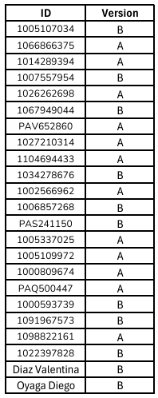

# Taller 8 - Apps & Rounds
---
## Fecha de entrega: 1 Octubre 2025
---

## Apps

- Una **app** es como una carpeta modular que contiene todo lo necesario para una parte del experimento:

  - **Modelos:** clases `Player`, `Group`, `Subsession` (donde se guardan datos).

  - **Páginas:** pantallas que ve el participante.

  - **Constantes:** configuración como `PLAYERS_PER_GROUP`, `NUM_ROUNDS`, etc.

  - **Lógica:** cálculos de pagos, reglas del juego, funciones de asignación de grupos.

- **Independencia:** cada app es relativamente autónoma. Esto facilita reutilizar apps en distintos experimentos.

- **Secuencia de apps:** en `settings.py` defines el orden:

```python
    SESSION_CONFIGS = [
        dict(
            name='mi_experimento',
            app_sequence=['consent', 'juego', 'cuestionario'],
            num_demo_participants=2,
        ),
    ]
```
*Aquí, el experimento tendrá 3 apps, ejecutadas en ese orden.*

---

## Rounds

- Cada app puede repetirse varias veces mediante `NUM_ROUNDS`.

- oTree crea automáticamente un **ciclo de rondas:**

    - `Subsession(round_number=1)`

    - `Subsession(round_number=2)`

    - … hasta `NUM_ROUNDS`.

- En cada ronda:

    - Se generan nuevos objetos de **Player** (uno por participante).

    - Se generan nuevos objetos de **Group** (dependiendo de `PLAYERS_PER_GROUP`).

    - Puedes **heredar información de rondas anteriores** usando funciones como `in_round(n)` o `in_previous_rounds()`.

- Ejemplo de configuración en `Constants`:

```python
    class C(BaseConstants):
        NAME_IN_URL = 'mi_juego'
        PLAYERS_PER_GROUP = 2
        NUM_ROUNDS = 5
```

*Esto significa que la app `mi_juego` tendrá **5 repeticiones.***

---

### Ejemplo práctico

Supongamos un **juego de negociación** de 5 rondas dentro de una app:

```python
    from otree.api import *

    class C(BaseConstants):
        NAME_IN_URL = 'negociacion'
        PLAYERS_PER_GROUP = 2
        NUM_ROUNDS = 5

    class Subsession(BaseSubsession):
        pass

    class Group(BaseGroup):
        total = models.CurrencyField(initial=100)

    class Player(BasePlayer):
        oferta = models.CurrencyField()

    class Oferta(Page):
        form_model = 'player'
        form_fields = ['oferta']

    class Resultados(Page):
        @staticmethod
        def vars_for_template(player: Player):
            return dict(
                oferta=player.oferta,
                ronda=player.round_number,
            )

    page_sequence = [Oferta, Resultados]
```

*Aquí, cada jugador hará una oferta en cada ronda, y oTree manejará automáticamente los datos de cada repetición.*

---

## Diferencia clave

- **Apps:** dividen el experimento en fases distintas.

- **Rounds:** permiten repetir la misma fase varias veces.

---

## Juego de Esfuerzo Real (Real Effort)

Es una tarea diseñada para medir el desempeño individual bajo presión de tiempo.

- El participante debe resolver una tarea repetitiva y sencilla (ejemplo: identificar la flecha que apunta a la derecha en una matriz de símbolos).

- Tiene 90 segundos para resolver tantos ejercicios como pueda.

- Cada acierto suma a su resultado, mientras que los errores restan.

- La cantidad de aciertos y fallos sirve como base para calcular su ganancia monetaria en esa fase.

Este juego representa la idea de que el esfuerzo individual tiene consecuencias directas en la recompensa obtenida.

---

## Juego de Intercambio (Empleador–Empleado)

Es un juego de interacción estratégica entre dos participantes con roles distintos:

- Ambos jugadores reciben un pago inicial desigual: el empleador parte con 70 y el empleado con 30.

- El empleador observa cuántos aciertos y fallos tuvo el empleado en la fase de esfuerzo real.

- Con esa información, el empleador puede decidir si otorgar una bonificación al empleado.

- Si decide darla, esa cantidad se suma al pago del empleado pero se resta del pago del empleador en igual proporción.

Este juego busca simular situaciones de reciprocidad, normas sociales y justicia distributiva, mostrando cómo la productividad de un trabajador puede influir en la decisión de un empleador de recompensar o no.

---

## 📚 Actividad practica


❗**Nota:** `Recordar usar el método de entrega de actividades y parciales indicado en la sección de "Entrega de actividades y parciales" del curso.` *[Click para visitar "Entrega de actividades y parciales" en la introducción del curso.](../../README.md)*

1. [QUIZ Social Norms](https://forms.gle/YfVqW3ptrC58FCYFA)

2. Real Effort + Intercambio:

    - Versión A:

        a. Realizar un Fetch del repositorio de GitHub.

        b. Agregar la app `real_effort` a la secuencia de apps en `settings.py` antes de `intercambio`.

        c. Al finalizar la app `real_effort`, debemos enviar los intentos fallidos a la app `intercambio` para que el empleador pueda verlos. Implementar esta funcionalidad.

        d. En la app `intercambio`, debemos recibir los intentos fallidos del empleado para mostrarlos posteriormente al empleador. Implementar esta funcionalidad.

        e. Debemos sumar la ganancia que traíamos de la app `real_effort` a la ganancia del empleado en la app `intercambio`. Implementar esta funcionalidad.

        f. Verificar que el juego funcione correctamente.


    ---

    - Versión B:

        a. Realizar un Pull del repositorio de GitHub.

        b. Agregar la app `intercambio` a la secuencia de apps en `settings.py` después de `real_effort`.

        c. Al finalizar la app `real_effort`, debemos enviar los intentos correctos a la app `intercambio` para que el empleador pueda verlos. Implementar esta funcionalidad.

        d. En la app `intercambio`, debemos recibir los intentos correctos del empleado para mostrarlos posteriormente al empleador. Implementar esta funcionalidad.

        e. Debemos enviar la ganancia que conseguimos en la app `real_effort` a la app `intercambio` para usarla posteriormente. Implementar esta funcionalidad.

        f. Verificar que el juego funcione correctamente.

En la siguiente lista se realiza la asignación de la versión a entregar. La asignación se realizó **al azar** y a **cada ID** de le asignó **una versión**: 



Dependiendo de la versión asignada, deberás cumplir con las tareas correspondientes a cada una y para una mejor verificación de lo realizado **tomar una ScreenShot al finalizar cada inciso**, **adjuntar las imágenes con el proyecto creado en un zip al correo designado**. Evitar archivos adicionales en el zip, **solo** debe contener la carpeta del proyecto y las imágenes solicitadas. Verificar que el proyecto enviado tenga los **cambios guardados**.

Enlaces de interés:

- [Apoyo Taller 8]()

- [Rúbrica de calificación](Rubrica_Taller_otree-realeffort.pdf)