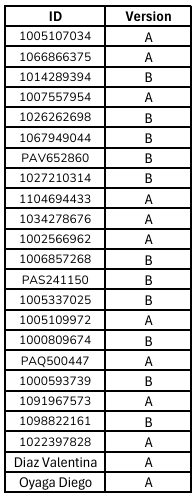

# Taller 9 - Treatments & Timeouts
---
## Fecha de entrega: 08 Octubre 2025
---

## Treatments

Un treatment (tratamiento) es básicamente una condición experimental.
En oTree se manejan principalmente a través de `subsession.creating_session` o desde la configuración en `settings.py`:

- Se pueden definir tratamientos en el archivo `settings.py` en la lista `SESSION_CONFIGS`, por ejemplo:

```python
    SESSION_CONFIGS = [
        dict(
            name='juego_esfuerzo',
            app_sequence=['juego_esfuerzo'],
            num_demo_participants=2,
            treatment='dificil',   # <- Tratamiento definido aquí
        ),
        dict(
            name='juego_esfuerzo_facil',
            app_sequence=['juego_esfuerzo'],
            num_demo_participants=2,
            treatment='facil',
        ),
    ]
```
- Luego, en el código del juego (en `__init__.py`), puedes acceder a ese valor con:

```python
    class Subsession(BaseSubsession):
        def creating_session(self):
            for p in self.get_players():
                p.treatment = self.session.config['treatment']
```

- Así, puedes cambiar reglas, pagos, número de rondas o dificultad dependiendo del treatment. Ya que:
    - Treatment = condición experimental.

    - Se define en `SESSION_CONFIGS`.

    - Se usa dentro del juego para personalizar la experiencia de cada sesión.

---
## Timeouts

Los timeouts se usan para limitar el tiempo que un jugador tiene para responder en una página.
Se configuran en la clase de cada `Page`.`

Ejemplo:

```python
    class Decision(Page):
        form_model = 'player'
        form_fields = ['respuesta']

        # tiempo límite en segundos
        timeout_seconds = 10

        # valor por defecto si no responde
        def before_next_page(player, timeout_happened):
            if timeout_happened:
                player.respuesta = -1
```

Explicación:

- `timeout_seconds = 10` → el jugador tiene 10 segundos para contestar.

- `before_next_page` con `timeout_happened` permite asignar un valor automático si el tiempo se acaba (ej. `-1`).

- También puedes redirigir al jugador a otra página si se acabó el tiempo.

---

## Resumen

- **Treatments:** manejan condiciones experimentales. Se definen en `settings.py` y se usan dentro del experimento para variar reglas, pagos, dificultad, etc.

- **Timeouts:** controlan el tiempo en cada página. Sirven para limitar respuestas, asignar valores automáticos o avanzar aunque el jugador no conteste.

---
### Recursos útiles

- [Documentación oficial de oTree - Treatments](https://otree.readthedocs.io/en/latest/treatments.html)

- [Documentación oficial de oTree - Timeouts](https://otree.readthedocs.io/en/latest/timeouts.html)

- [Ejemplos oficiales de oTree](https://www.otreehub.com/)

- [Guía rápida de oTree en español (GitHub)](https://github.com/otree-org/otree)


---

## 📚 Actividad practica


❗**Nota:** `Recordar usar el método de entrega de actividades y parciales indicado en la sección de "Entrega de actividades y parciales" del curso.` *[Click para visitar "Entrega de actividades y parciales" en la introducción del curso.](../../README.md)*

1. [QUIZ Time Preferences and Risk Preferences](https://forms.gle/LgEvGoHs9g8VmU2T6)

2. Search Experiment:

    - Versión A:

        a. Realizar un Fetch del repositorio de GitHub.

        b. En la función `creating_session` de la app `instructions`, falta una línea que asigna el treatment al participante complétala.

        c. En la función `get_decision_turns_a` de la app `instructions`, se quiere que cuando `treatment` tome el valor de 4, la variable devuelva 5, pero actualmente el código no lo asegura. Corrige la condición.

        d. En la app `search_app_b` existe una pagina llamada `Play` la cual debe pasar datos cuando el tiempo acabe, pero en el código actual no lo hace. Corrige el error.


    ---

    - Versión B:

        a. Realizar un Fetch del repositorio de GitHub.

        b. En `creating_session` de la app `instructions`, después de asignar el treatment, también se calculan los valores de `decision_turns_c`. Completa la función.

        c. En la función `get_decision_turns_b` de la app `instructions`, necesitamos definir que variable tomara para la función. Asigna un treatment.

        d. En la app `search_app_a` existe una pagina llamada `Play` la cual debe pasar datos cuando el tiempo acabe, pero en el código actual no lo hace. Corrige el error.


❗**Nota:** `Este taller no debe verificarse en el servidor developer de oTree, tiene variables desactivadas que impiden su correcta ejecución. Solo debe realizarse los cambios solicitados y enviarse en un zip.`


En la siguiente lista se realiza la asignación de la versión a entregar. La asignación se realizó **al azar** y a **cada ID** de le asignó **una versión**: 



Dependiendo de la versión asignada, deberás cumplir con las tareas correspondientes a cada una y para una mejor verificación de lo realizado **tomar una ScreenShot al finalizar cada inciso**, **adjuntar las imágenes con el proyecto creado en un zip al correo designado**. Evitar archivos adicionales en el zip, **solo** debe contener la carpeta del proyecto y las imágenes solicitadas. Verificar que el proyecto enviado tenga los **cambios guardados**.

Enlaces de interés:

- [Apoyo Taller 9](https://youtu.be/0bf4vJHd2Rc)

- [Rúbrica de calificación]()