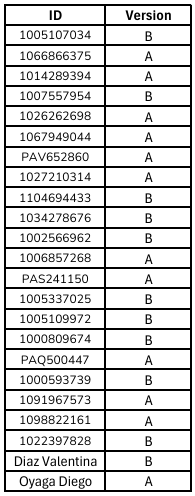

# Taller 10 - Chat & Live Pages
---
## Fecha de entrega: 15 Octubre 2025
---

## Chat

El **Chat** en oTree permite que los participantes se comuniquen entre sí en tiempo real durante una o varias páginas del experimento.
Se usa principalmente en juegos grupales para fomentar la interacción, la negociación o la cooperación entre jugadores.

- Desde las versiones más recientes de oTree, el chat se incluye fácilmente en las plantillas HTML con el componente:

```html
    {{ chat }}
```

Este componente genera automáticamente un panel de chat en la página, mostrando los mensajes en tiempo real entre los miembros del mismo grupo.

Ejemplo de uso:

```python
    class Conversacion(Page):
        pass
```


Y en la plantilla `Conversacion.html`:

```html
    
    
        <h3>Comunícate con tu grupo</h3>
        {{ chat }}
    
```

**Explicación:**

- `{{ chat }}` inserta un chat funcional sin necesidad de escribir código adicional.

- Los mensajes se comparten solo entre los jugadores del mismo grupo.

- No es necesario definir un `live_method` para que funcione.

- El registro de los mensajes queda almacenado automáticamente en la base de datos.

**Ventajas:**

- Implementación inmediata.

- Comunicación fluida en tiempo real.

- Sin necesidad de configuración adicional de funciones en el backend.

---

## Live Pages

Las **Live Pages** permiten la comunicación en tiempo real entre los jugadores y el servidor, sin recargar la página.
Son útiles cuando se necesita que las acciones o variables cambien dinámicamente según las decisiones de los jugadores.

Ejemplo:

```python
    class Juego(Page):
        live_method = 'live_juego'
```

Y en el modelo (por ejemplo, en `Group`):

```python
    def live_juego(player, data):
        if data['type'] == 'movimiento':
            player.puntaje = data['valor']
            # Enviar actualización a todos los jugadores del grupo
            return {0: dict(jugador=player.id_in_group, puntaje=player.puntaje)}
```

**Explicación:**

- `live_method` define el canal de comunicación entre cliente y servidor.

- `data` contiene la información que el navegador envía (clics, valores, acciones).

- `{0: ...}` envía datos a todos los jugadores del grupo (broadcast).

**Ventajas:**

- Interacciones en tiempo real.

- Actualización automática de variables y elementos visuales.

- Ideal para juegos dinámicos (subastas, coordinación, reflejos, tableros).

---

## Resumen

- **Chat:**
    Permite comunicación directa entre los jugadores de un grupo.
    Se incluye fácilmente en la plantilla con `{{ chat }}`.
    Ideal para fases de negociación, coordinación o discusión.

- **Live Pages:**
    Permiten interacción y actualización en tiempo real sin recargar la página.
    Se definen mediante `live_method` en la clase `Page`.
    Ideales para juegos simultáneos, subastas o dinámicas interactivas.

---

### Recursos útiles

- [Documentación oficial de oTree - Live Pages](https://otree.readthedocs.io/en/latest/live.html)

- [Ejemplos oficiales de oTree](https://www.otreehub.com/)

- [Guía rápida de oTree en español (GitHub)](https://github.com/otree-org/otree)


---

## 📚 Actividad practica


❗**Nota:** `Recordar usar el método de entrega de actividades y parciales indicado en la sección de "Entrega de actividades y parciales" del curso.` *[Click para visitar "Entrega de actividades y parciales" en la introducción del curso.](../../README.md)*

1. [QUIZ ]()

2. GPT MASTER:

    - Versión A:

        a. Realizar un Fetch del repositorio de GitHub.

        b. En la app `chat_complex` debemos encontrar el mensaje de activación del bot que se encuentra en el template `chat.html`. Modificaremos el `liveSend` para que envié `event` y `botMsg` en este orden.

        c. En la pagina `chat` de la misma app, debemos agregar el parámetro `player` y `data` al método `live_method` para recibir los datos enviados desde el front-end.

        d. En esta misma pagina y función, debemos grabar el tipo de evento usando `data['event']` en la variable `event`.

        e. En el template `chat.html` de la app `chat_voice` debemos agregar que el método `liveRecv` reciba el parámetro `data` del servidor.

    ---

    - Versión B:

        a. Realizar un Fetch del repositorio de GitHub.

        b. En la app `chat_simple` debemos encontrar el mensaje de activación del bot que se encuentra en el template `chat.html`. Modificaremos el `liveSend` para que envié `event` y `botMsg` en este orden.

        c. En la pagina `chat` de la misma app, debemos agregar el parámetro `player` y `data` al método `live_method` para recibir los datos enviados desde el front-end.

        d. En esta misma pagina y función, debemos corregir la condición que verifica los `event` en los datos recibidos, agregando esta variable.

        e. En el template `chat.html` de la app `chat_multiple_agents` debemos agregar que el método `liveRecv` reciba el parámetro `data` del servidor.


❗**Nota:** `Este taller no debe verificarse en el servidor developer de oTree, tiene variables desactivadas que impiden su correcta ejecución. Solo debe realizarse los cambios solicitados y enviarse en un zip.`


En la siguiente lista se realiza la asignación de la versión a entregar. La asignación se realizó **al azar** y a **cada ID** de le asignó **una versión**: 



Dependiendo de la versión asignada, deberás cumplir con las tareas correspondientes a cada una y para una mejor verificación de lo realizado **tomar una ScreenShot al finalizar cada inciso**, **adjuntar las imágenes con el proyecto creado en un zip al correo designado**. Evitar archivos adicionales en el zip, **solo** debe contener la carpeta del proyecto y las imágenes solicitadas. Verificar que el proyecto enviado tenga los **cambios guardados**.

Enlaces de interés:

- [Apoyo Taller 10](https://youtu.be/e3BNtuxCwaQ)

- [Rúbrica de calificación]()