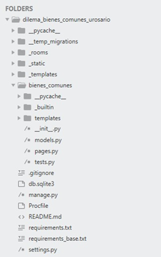

# Examen Final - Implementación de Experimentos en Heroku
---

## 1. Crear cuenta en Heroku

Para usar Heroku, primero se debe crear una cuenta en [Heroku](https://www.heroku.com). El registro requiere un correo electrónico y confirmación por e-mail. Actualmente, Heroku ya no ofrece plan gratuito, por lo que es necesario asociar una tarjeta de crédito o débito a la cuenta para poder crear aplicaciones (El cobro es bajo y se maneja por uso, mas adelante lo explicaremos).

---

## 2. Git

Heroku ejecuta las aplicaciones en fragmentos de servidor llamados **Dynos**, que permiten que los usuarios accedan a los experimentos por internet. Para enviar el proyecto desde el computador local a esos Dynos, se utiliza **Git**, un sistema de control de versiones que permite transferir, actualizar y mantener el código sincronizado entre el entorno local y la nube. En este contexto, Git se usa únicamente para subir nuevas versiones del proyecto a Heroku.

---

## 2.1 Instalar Git

Para instalar Git, se debe descargar el instalador desde [GIT](https://git-scm.com/downloads) según el sistema operativo. Git se usa desde la consola de comandos, sin crear accesos directos visibles. Al usarlo por primera vez, es necesario configurar el nombre y correo del usuario para registrar la autoría de los cambios en el proyecto.

> git config --global user.name "John Doe" 
> git config --global user.email johndoe@example.com 

Donde en lugar de John Doe y del correo example, se ubican sus datos personales. 

---

## 3. CLI de Heroku

La CLI de Heroku es una herramienta que permite ejecutar comandos de Heroku desde la terminal. Se debe descargar e instalar desde [CLI HEROKU](https://devcenter.heroku.com/articles/heroku-cli), eligiendo el instalador correspondiente al sistema operativo. Con esta interfaz, el usuario puede gestionar y desplegar aplicaciones directamente desde la línea de comandos.

---

## 4. Proyecto oTree

Con Git y la CLI de Heroku instalados, ya se puede crear y enviar un proyecto de oTree a la nube. El proyecto debe tener una estructura organizada dentro de una carpeta raíz, que contiene todos los archivos y subdirectorios del experimento. Entre ellos destacan los archivos `.py` (código en Python), los `.txt` y `.md` (configuración e información), el `Procfile` (que indica a Heroku cómo iniciar el servidor) y el `.gitignore` (que define qué archivos no se deben subir al servidor). Algo similar a la imagen a continuación:

---

## 5. Transferir proyecto a Heroku (Git)

Para transferir el proyecto de oTree a Heroku, se debe abrir PowerShell o la terminal y ubicarse en la carpeta raíz del proyecto usando el comando `cd`. Desde allí se ejecutarán los comandos necesarios para enviar la aplicación. Si es necesario retroceder a una carpeta superior, se usa `cd ...` Esta navegación asegura que los comandos de Git y Heroku se apliquen al proyecto correcto antes de transferirlo.

Una vez allí, se hace inicio de sesión en Heroku con los datos ingresados al crear la cuenta, con el comando:  

> heroku login 

El programa le solicitará la información necesaria. 

Posteriormente se inicia un repositorio local que se enviará a Heroku, para esto, se ejecuta:  

> git init 

Luego, se crea un proyecto en Heroku que albergará las configuraciones del servidor. Para esto, se emplea el comando:  

> heroku create nombre-del-proyecto

Ahora debemos ingresar a nuestro proyecto en Heroku desde nuestro navegador y entraremos en la app que hemos creado para nuestro proyecto oTree. Luego iremos a la pestaña de `Resources` y buscaremos `Redis Cloud` en la sección de `Add-ons`.

Ahi seleccionaremos el plan gratuito `Redis Cloud - 30 MB Free` y lo añadiremos a nuestra app. (Aunque la base de datos es "gratuita", Heroku puede pedirnos datos de una tarjeta de crédito o débito para verificar la cuenta y cobrar el despliegue de la misma). 

A continuación, se prepara la aplicación para enviarla. Se ejecuta: 

> git add . 
> git commit -m “Comentario sobre la versión que se manda” 

Y finalmente, se envía a Heroku: 

> git push heroku master

(O en caso de que la rama principal se llame **main**, se usa `git push heroku main`)  

Con todo lo anterior, el servidor habrá quedado montado en Heroku. Para acceder a la aplicación se puede ingresar al enlace nombre.herokuapp.com, o bien ejecutar:

> heroku open 

---

## Configuraciones Adicionales

En caso adicional de necesitar una base de datos para almacenar datos de los experimentos, se puede añadir el complemento `Heroku Postgres` desde la pestaña de `Resources`, al igual que se hizo con Redis.

De igual forma en un entorno real se debe desactivar el modo de desarrollo "DEBUG".

En caso de querer realizar estas configuraciones adicionales, se puede consultar el documento *[Manual para implementar experimentos de oTree en Heroku](../../despliegue/Manual_para_implementar_experimentos_de_oTree_en_Heroku.pdf)* realizado por *Alfredo Eleazar Orozco Quesada, Laura Prada Medina, Darwin Cortés y César Mantilla - Noviembre del 2019*. En el cual se basa esta guía rápida.

❗**Nota:** `En caso de requerir usar esta guía, tener en cuenta que el plan "hobby-dev" fue descontinuado. El 28 de noviembre de 2022, Heroku anunció que ya no ofrecería planes gratuitos como los Dynos gratuitos, hobby-dev para Postgres, ni hobby-dev para Redis. Los planes existentes han sido programados para eliminación o conversión automática.`

---

## 📖 Parte Práctica para el Examen Final

- Implementar el proyecto en Heroku (Un dia hábil, notificar al docente con enlace sobre la aplicación para su revision)
- Recolectar 10 datos de "bots" (jugadores automáticos)
- Gráfica de los resultados obtenidos
- Análisis de Gráfica y Resultados
- Conclusiones