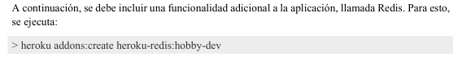
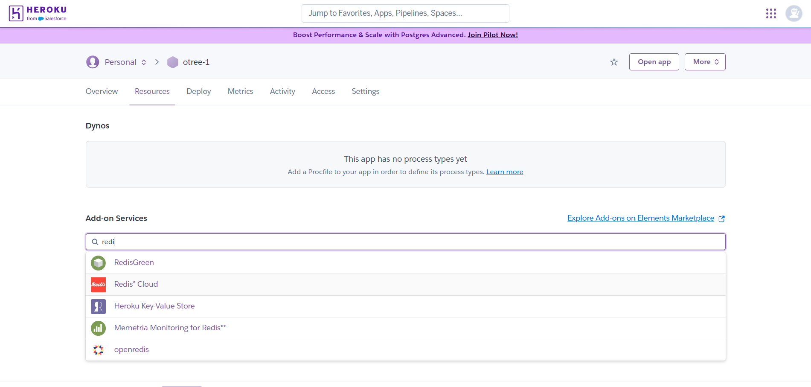
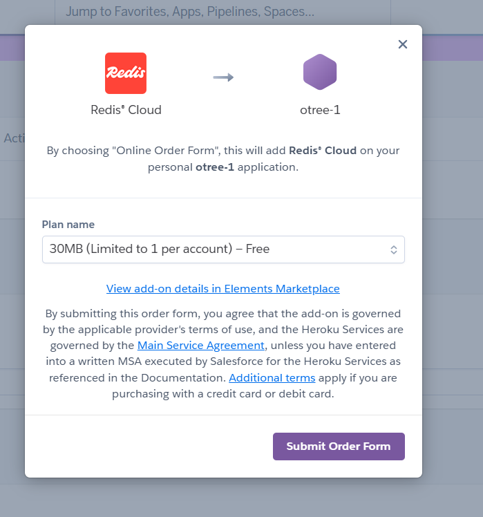
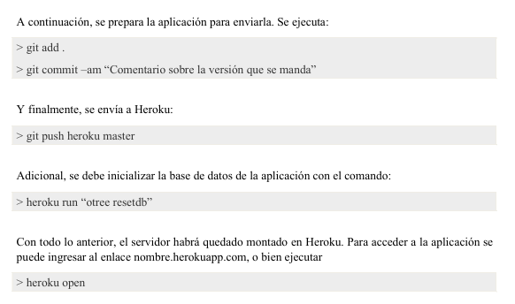

# Despliegue mediante Heroku

**Nota:** Esta guía esta basada en la documentación *[Manual para implementar experimentos de oTree en Heroku](Manual_para_implementar_experimentos_de_oTree_en_Heroku.pdf)* realizada por *Alfredo Eleazar Orozco Quesada, Laura Prada Medina, Darwin Cortés y César Mantilla - Noviembre del 2019*

## Guía rápida para desplegar en Heroku

1. Usaremos los pasos del 1 al 4 indicados en el manual mencionado arriba.

Para el 5 paso nos encontraremos con diferencias en la forma de configurar el despliegue, debido a que el plan `hobby-dev` fue descontinuado. El 28 de noviembre de 2022, Heroku anunció que ya no ofrecería planes gratuitos como los dynos gratuitos, hobby-dev para Postgres, ni hobby-dev para Redis. Los planes existentes han sido programados para eliminación o conversión automática.

Debido a esto tomaremos una ruta diferente para **Transferir a un repositorio en Heroku (Git)**.

En este paso 5, comenzaremos con lo indicado en el manual, hasta llegar a la parte de ` incluir una funcionalidad adicional a la aplicación`. 

En lugar de usar el comando `heroku addons:create heroku-redis:hobby-dev` abriremos nuestra cuenta de heroku en el navegador y entraremos en la app que hemos creado para nuestro proyecto oTree. Luego iremos a la pestaña de `Resources` y buscaremos `Redis Cloud` en la sección de `Add-ons`.

Ahi seleccionaremos el plan gratuito `Redis Cloud - 30 MB Free` y lo añadiremos a nuestra app. (Aunque la base de datos es "gratuita", Heroku puede pedirnos datos de una tarjeta de crédito para verificar la cuenta y cobrar el despliegue de la misma).

Al realizar esto podremos seguir con los pasos indicados en el manual para enviar nuestro proyecto a Heroku.

Algo que puede generar error es el comando `git push heroku master`, ya que puede que la rama principal de git no se llame `master`, sino `main`. En ese caso el comando correcto sería: `git push heroku main`.

Adicional a lo anterior hay en cuenta que algunos pasos como `heroku run “otree resetdb” ` pueden ser omitidos, ya que esto solo se debe hacer si se quiere reiniciar la base de datos del proyecto en Heroku. Asi como lo relacionado a `OtreeHub`, ya que no es obligatorio usarlo para desplegar en Heroku, solo si desea usar esa plataforma como intermediario.

En caso de necesitar una base de datos para almacenar datos de los experimentos, se puede añadir el complemento `Heroku Postgres` desde la pestaña de `Resources`, al igual que se hizo con Redis.

Para mayor información, consultar la pagina de ayuda de Heroku: [Heroku Help](https://help.heroku.com/)